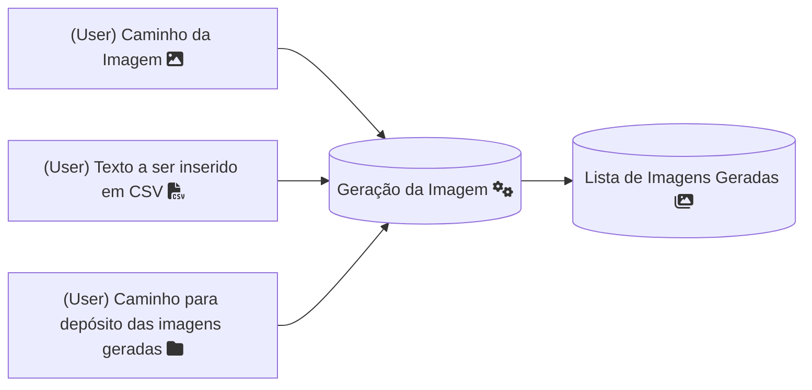

# CSharp_GenCertificados [For study purposes]

Um programa que gera certificados de acordo com imagens e uma lista de palavras informadas pelo usuário.

## Funcionalidades

- **Caminho da Imagem de Origem:** Solicita ao usuário o caminho da imagem BMP que será utilizada como base.
- **Texto a ser Inserido:** Solicita ao usuário uma lista de textos em formato CSV para serem inseridos na imagem.
- **Caminho para Depósito das Imagens Geradas:** Solicita ao usuário o caminho onde as imagens geradas serão salvas.

## Tecnologias Utilizadas

- **Linguagem de Programação:** C#
- **Framework:** .NET
- **Manipulação de Imagens:** System.Drawing, System.Drawing.Imaging

## Estrutura de Código
- Monolito
  
### Classes Principais

- **Main:** Classe principal que contém o método `GenerateImage`, responsável por gerar as imagens com os textos inseridos.

## Requisitos de Sistema

- **Ambiente de Desenvolvimento:** Visual Studio 2022
- **Framework:** .NET SDK
- **Sistema Operacional:** Windows, Linux, macOS

## Fluxo de Funcionamento

## Instruções de Uso

1. **Executar o Programa:**
   - O usuário será solicitado a inserir o caminho da imagem BMP que deseja utilizar.
   - O usuário será solicitado a inserir a lista de textos em formato CSV.
   - O usuário será solicitado a inserir o caminho onde as imagens geradas serão salvas.

2. **Geração das Imagens:**
   - O programa irá gerar novas imagens com os textos inseridos e salvá-las no caminho especificado.

---
