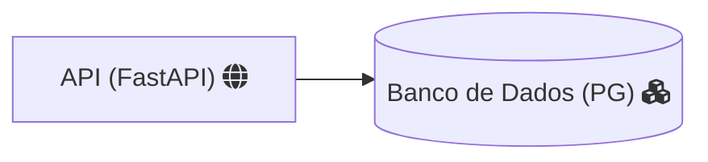

# GERADORCERTIFICADOS
Um programa que gera certificados de acordo com imagens e uma lista de palavras informadas pelo usuario

Este é um exemplo de um fluxograma construído com Mermaid.

```mermaid
graph LR;
    A["API (FastAPI) fa:fa-globe"]
    B[("Banco de Dados (PG) fa:fa-cubes")]
    A --> B
```
