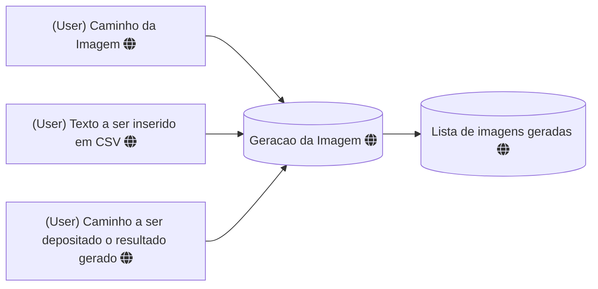

# GERADORCERTIFICADOS
Um programa que gera certificados de acordo com imagens e uma lista de palavras informadas pelo usuario

Informações a serem coletadas no inicio

- Caminho da imagem de origem
- Texto a ser inserido
- Caminho para o deposito das imagens geradas

